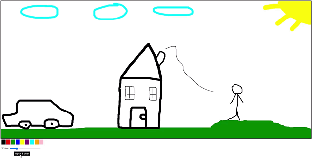

# Paint 🎨

> Create drawings and enjoy the main feature of the app 😀

### See the <a href='https://dnt-knw.github.io/Paint' target='_blank' title='Click to open the project'>Demo</a> 👁

## Where to start ❓

<ul>
    <li>📜 Click to color you want to use and then draw  </li>
    <li>📜 After drawing click the "Repeat & clear" button to see the program in action  </li>
    <li>📜 When the replay is complete, you will be able to clear the canvas  </li>
</ul>

## How the program works ❓

<ul>
    <li>📜 It remembers the coordinates of the lines that you draw  </li>
    <li>📜 It remembers the lines width that they have  </li>
    <li>📜 It remembers the colors you used  </li>
    <li>📜 It processes all this data and draw what you have done  </li>
</ul>
